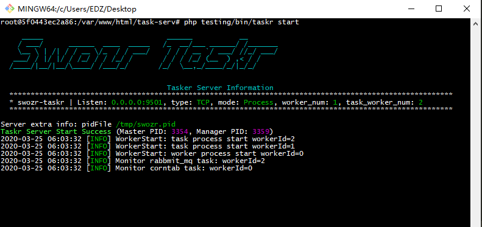

# testing

## testing taskr 服务 



>实际嵌入php框架时在console控制器使用指定命令路由调用TaskrEngine的相应方法

启动服务
```bash
    php bin/taskr start
```

查看服务状态
```bash
    php bin/taskr status
```

停止服务
```bash
    php bin/taskr stop
```

reload服务
```bash
    php bin/taskr reload
```

重启服务
```bash
    php bin/taskr restart
```

## testing taskr 客户端
>实际直接参考发布任务部分
* 多个arg即发布多个任务 当
* -t a 则发布延迟a毫秒的延迟任务 
 ```bash
    php bin/taskr-client-test arg ...
```
 ```bash
    php bin/taskr-client-test arg ... -t 1000
```


